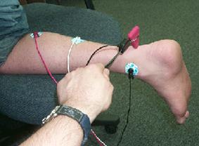

# Project 2: EMG reflex

### Project information
- [Assignment description and learning objectives](project_2_EMG/project_2_EMG.pdf)
- [Report draft rubric](project_2_EMG/EMG_report_DRAFT_rubric.pdf)
- [Final report rubric](project_2_EMG/EMG_report_rubric.pdf)

### Weekly lab exercises
- Week 1 (10/17): [Lab protocol](project_2_EMG/EMG_lab_1.pdf) and [in class assignment](project_2_EMG/EMG_lab_1_assignment.pdf)
- Week 2 (10/24): [Lab protocol](project_2_EMG/EMG_lab_2.pdf) and [in class assignment](project_2_EMG/EMG_lab_2_assignment.pdf)
- Week 3 (10/31): [Lab protocol](project_2_EMG/EMG_lab_3.pdf) and [in class assignment](project_2_EMG/EMG_lab_3_assignment.pdf)
- Week 4 (11/07): [Lab protocol](project_2_EMG/EMG_lab_4.pdf) and [in class assignment](project_2_EMG/EMG_lab_4_assignment.pdf)
- Week 5 (11/14): [Lab protocol](project_2_EMG/EMG_lab_5.pdf)
- Week 6 (11/28): **Project demos and report due!**