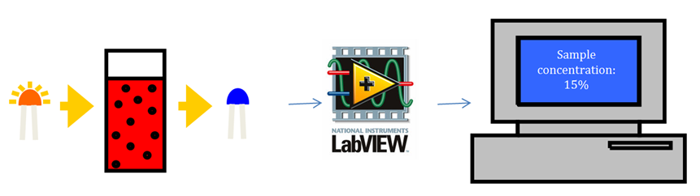
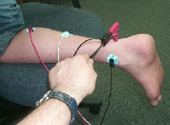
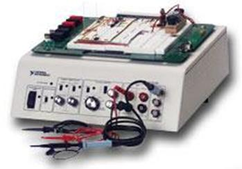

# Welcome to BIOE 385!

## General course information
- [Syllabus](general_course_materials/syllabus.pdf)
- [Full assignment list with deadlines](general_course_materials/assignments.pdf)
- Teaching team
	- Instructor: Dr. James Long (james.long@rice.edu)
	- TAs:
		- *Monday:* Drew Bonham (drew.bonham@rice.edu)
		- *Wednesday:* Samira Hajebrahimi (samira.hajebrahimi@rice.edu)
		- *Thursday:* Nicole Sevilla (nicole.sevilla@rice.edu)
- Canvas sites (for grades)
	- [Monday](https://canvas.rice.edu/courses/52096)
	- [Wednesday](https://canvas.rice.edu/courses/51530)
	- [Thursday](https://canvas.rice.edu/courses/51533)

## Resources
- [Project 1: Optical immunoassay](https://jameslong12.github.io/BIOE385/OIA)
- [Project 2: EMG reflex](https://jameslong12.github.io/BIOE385/EMG)
- [Full supply list](general_course_materials/supply_list.pdf)
- [Data sheets](https://github.com/jameslong12/BIOE385/tree/main/additional_resources/data_sheets)
- [LabView resources](https://github.com/jameslong12/BIOE385/tree/main/additional_resources/labview_guides)
- [General electronics resources](https://github.com/jameslong12/BIOE385/tree/main/additional_resources/electronics_guides)